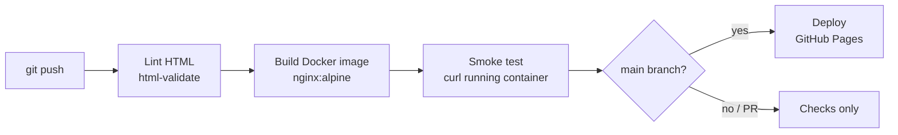

# Shobhin Gowrisankar | DevOps Portfolio


Personal portfolio site for **Shobhin Gowrisankar Balasubramaniam**, DevOps and Site Reliability Engineer based in Atlanta, GA.

**Live site:** https://YOUR-USERNAME.github.io/YOUR-REPO/

The site itself is delivered through a small CI/CD pipeline: every push is linted, built into a container, smoke-tested, and deployed to GitHub Pages only when every stage passes.

## Pipeline



| Stage | What it does |
|---|---|
| **Lint** | Validates the HTML with `html-validate` so broken markup never ships |
| **Build** | Packages the site into an NGINX container image |
| **Smoke test** | Runs the container and checks the page responds with the expected content |
| **Deploy** | Publishes to GitHub Pages; runs only on `main` after all checks pass |

Pull requests run lint, build, and smoke test without deploying.

## Run locally

With Docker:

```bash
docker build -t portfolio .
docker run -d -p 8080:80 portfolio
# open http://localhost:8080
```

Without Docker:

```bash
cd site && python3 -m http.server 8080
```

## Repository layout

```
.
├── .github/workflows/deploy.yml   # CI/CD pipeline
├── site/index.html                # the portfolio page
├── Dockerfile                     # NGINX image for local runs and the smoke test
├── .htmlvalidate.json             # lint rules
└── README.md
```

## Contact

- LinkedIn: [www.linkedin.com/in/shobhin-gowrisankar](https://www.linkedin.com/in/shobhin-gowrisankar)
- Email: shobhingowrisankar@gmail.com
